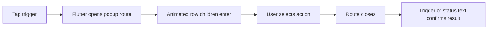

This image is a reminder that popup menus are usually opened in crowded app screens, so the motion has to clarify the action instead of stealing attention from the selected item.

The practical way to use `flutter_animate` with a Flutter `PopupMenuButton` is to animate the trigger, the custom row content, and the result state around the menu. Do not try to take over the popup route unless you are building a fully custom menu. The built-in popup already owns positioning, focus, keyboard dismissal, semantics, and outside-tap behavior. Motion should sit inside those boundaries.

I first tried to animate the whole menu like a normal widget panel. That looked fine in a demo, then broke once the menu opened near the bottom edge and Flutter flipped the route upward. The animation origin felt wrong, and the row tap target shifted while the user was moving a finger. The cleaner version keeps the route stable and gives each row a short fade-slide when it is built.

## Choose what moves

| Target | Good motion | Bad motion |
| --- | --- | --- |
| Trigger button | Tiny scale on open or after selection | Continuous pulsing while idle |
| Menu rows | 70-120 ms fade and vertical offset | Large slide that changes tap timing |
| Selected result | Brief highlight after the route closes | Reopening the menu just to show feedback |
| Destructive item | Color and icon emphasis | Shake on every hover or focus |

The key detail is that `PopupMenuItem` can contain any widget. That gives enough control for row-level animation without replacing Flutter's menu mechanics.

## Animate menu items

Here is a compact pattern for an overflow menu where each row appears with a small stagger. The menu route remains the stock `PopupMenuButton`.

```dart
import 'package:flutter/material.dart';
import 'package:flutter_animate/flutter_animate.dart';

enum CardAction { pin, archive, delete }

class AnimatedCardMenu extends StatefulWidget {
  const AnimatedCardMenu({super.key});

  @override
  State<AnimatedCardMenu> createState() => _AnimatedCardMenuState();
}

class _AnimatedCardMenuState extends State<AnimatedCardMenu> {
  CardAction? _lastAction;

  @override
  Widget build(BuildContext context) {
    return Row(
      children: [
        Expanded(
          child: AnimatedSwitcher(
            duration: 180.ms,
            child: Text(
              _lastAction == null
                  ? 'No action selected'
                  : 'Selected: ${_lastAction!.name}',
              key: ValueKey(_lastAction),
            ).animate().fadeIn(duration: 140.ms).slideY(begin: .25, end: 0),
          ),
        ),
        PopupMenuButton<CardAction>(
          tooltip: 'Card actions',
          onSelected: (action) => setState(() => _lastAction = action),
          itemBuilder: (context) => [
            _menuItem(0, CardAction.pin, Icons.push_pin_outlined, 'Pin'),
            _menuItem(1, CardAction.archive, Icons.archive_outlined, 'Archive'),
            _menuItem(2, CardAction.delete, Icons.delete_outline, 'Delete'),
          ],
          child: const Icon(Icons.more_vert),
        )
            .animate(target: _lastAction == null ? 0 : 1)
            .scaleXY(begin: 1, end: 1.08, duration: 90.ms)
            .then()
            .scaleXY(end: 1, duration: 120.ms),
      ],
    );
  }

  PopupMenuEntry<CardAction> _menuItem(
    int index,
    CardAction value,
    IconData icon,
    String label,
  ) {
    final isDestructive = value == CardAction.delete;

    return PopupMenuItem<CardAction>(
      value: value,
      child: Row(
        mainAxisSize: MainAxisSize.min,
        children: [
          Icon(
            icon,
            size: 18,
            color: isDestructive ? Colors.red.shade600 : null,
          ),
          const SizedBox(width: 12),
          Text(
            label,
            style: TextStyle(
              color: isDestructive ? Colors.red.shade600 : null,
            ),
          ),
        ],
      )
          .animate(delay: (index * 35).ms)
          .fadeIn(duration: 90.ms)
          .slideY(begin: .12, end: 0, duration: 110.ms),
    );
  }
}
```

This does three small things. The rows enter quickly, the trigger confirms a completed selection, and the label changes after `onSelected` fires. It does not animate the popup route itself, so keyboard focus and outside taps still behave like a normal Flutter menu.

## Where bugs usually appear

The first trap is putting an `Animate` chain around `PopupMenuButton` and expecting it to run when the route opens. The button remains in the original widget tree, while the popup contents are painted by the menu route. If the visual feedback belongs inside the menu, animate the widgets returned from `itemBuilder`.

The second trap is using long delays. A menu is a decision surface, not a loading state. If the third item starts 400 ms later, the user can tap before the row looks settled. I keep row delays below 40 ms each and total menu motion below about 180 ms.

The third trap is losing disabled-state clarity. `PopupMenuItem(enabled: false)` still accepts a child widget, but animated opacity can make disabled rows look temporarily active. If a row is disabled, set its final color first and use a very small fade, or skip row animation for that item.



For production screens, I also avoid animating menu width. A localized label, bold text scale, or desktop pointer hover can change the measured size. Width motion makes that feel like layout instability. Opacity, color, and a 2-4 pixel offset are usually enough.

## Short checklist

- Keep `PopupMenuButton` responsible for route behavior.
- Animate row children from `itemBuilder`, not the whole overlay.
- Keep total menu entry motion under roughly 180 ms.
- Confirm the selected action after the route closes.
- Skip decorative motion for disabled or destructive rows unless it improves recognition.

`flutter_animate` works best here when it adds a little sequencing to an interaction Flutter already handles well. The menu still opens like a menu, but the selected action no longer feels like a hard visual jump.
